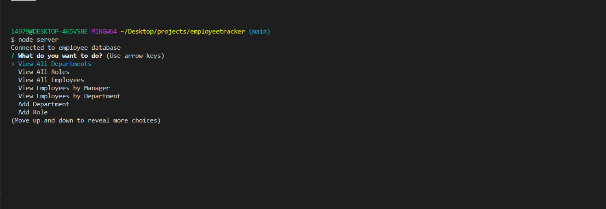

# Employee Tracker

## Table of Contents

* [Description](#Description)
* [Installation](#Installation)
* [Usage](#Usage)
* [License](#License)
* [Contributing](#Contributing)
* [Test](#Test)

## Description
As a business owner I want to be able to view and manage the departments, roles, and employees in my company so that I can organize and plan my business. This CLI (Command Line Interface) application will take and inject information to and from the database employee.db once sourced from schema and seeds files. 

## Installation

To initiate the application you must install the inquirer, MySQL2 and console.table module and its JSON files

    npm install inquirer
    npm install --save mysql2
    npm install console.table --save

Once this is finished check your package.json file ensure that these are saved to your dependency section.

## Usage
The application will first begin with a series of questions as shown below

The application will then be able to view, update, delete and add information to different tables within the database.

To see a demonstration to the application run look at the video below

## License
MIT  

## Badges

## Contributing
For anyone who wishes to contribute you can contact me with the information below

## Test
The database was checked in the terminal via the command:

    mysql -u root -p
    show database;
    SELECT * FROM employee;
    SELECT * FROM role;
    SELECT * FROM department;

Once they have been tested after the inquirer module was used it was ensured that the tables have been altared or deleted
    
Would you like to reach us?
 
Contact Me:

Github: https://github.com/aznjp

Email: Jpark103193@gmail.com
